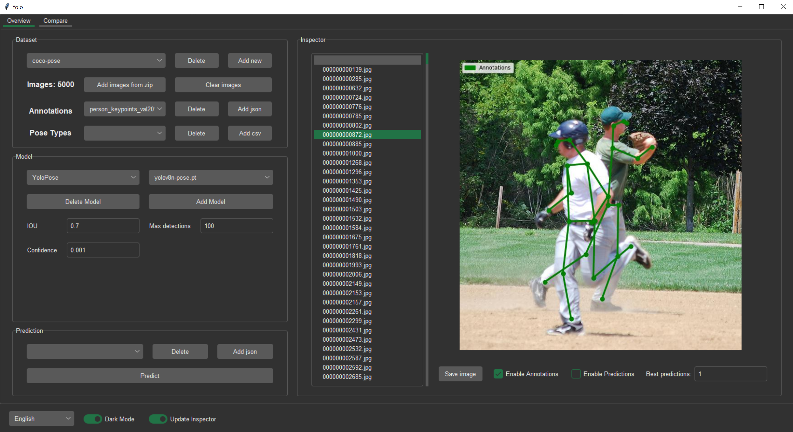
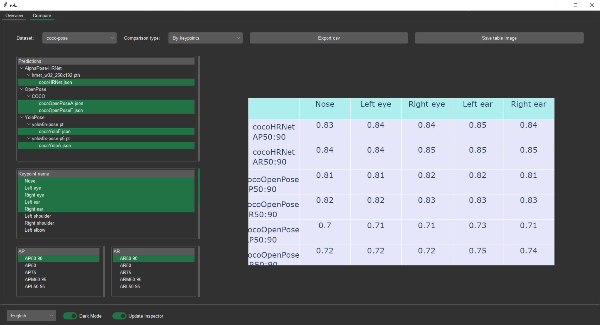

This tool allows an easy way of comparison for some popular pose prediction models.
There are three supported ways of comparison: 
* General for whole dataset
* By keypoint, for each keypoint in a pose
* By pose type, given additional config file. Compatible with LSP/MPII-MPHB Database dataset

Currently supported models:
* Yolo-pose by Ultralytics in Yolov8: https://github.com/ultralytics/ultralytics/tree/main
* OpenPose: https://github.com/CMU-Perceptual-Computing-Lab/openpose
* HRNet from AplhaPose: https://github.com/MVIG-SJTU/AlphaPose

Sample datasets:
* MSCOCO dataset: https://cocodataset.org/
* LSP/MPII-MPHB Database: https://parnec.nuaa.edu.cn/_upload/tpl/02/db/731/template731/pages/xtan/MPHB.html

Before using:
* pip install -r requirements.txt
* Make sure you have git app installed
* Optionally install CUDA. Supported version: 12.1

To use: python __init__.py

Launching the app without any data will result in a prompt to download two sample datasets and models from original sources.

Screenshots:

